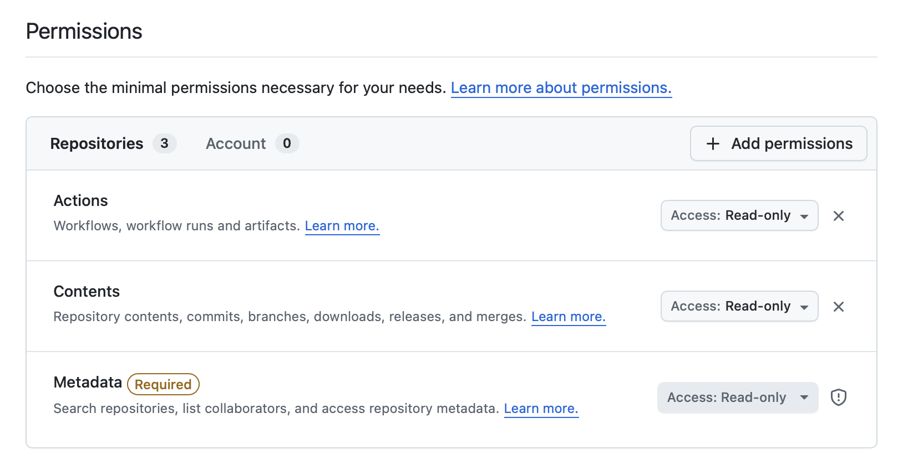

# Configuration

Rock ships with a ready-to-use GitHub Actions:

- [`callstackincubator/ios`](https://github.com/callstackincubator/ios)
- [`callstackincubator/android`](https://github.com/callstackincubator/android)

which you can include in your GHA workflows to build iOS and Android apps and store native artifacts to reuse across CI jobs and local dev environment through Rock CLI.

## GitHub Workflow Setup

This is the recommended base setup for a GitHub Workflow file running our GitHub Actions that:

- Runs the workflow on pushes to the `main` branch
- Runs the workflow on pull requests to any branch

```yaml
on:
  push:
    branches:
      - main
  pull_request:
    branches:
      - '**'

concurrency:
  group: remote-build-ios-${{ github.ref }}
```

## Setup GitHub Personal Access Token

You'll be asked about this token when cached build is available while running the `rock run:ios` or `rock run:android` commands. The token is necessary for downloading cached builds.

### Fine-grained tokens for organizations

Generate a [fine-grained Personal Access Token](https://github.com/settings/personal-access-tokens/new) and set **Resource owner** to your organization. Ensure the following repository permissions:

- Actions: Read
- Contents: Read
- Metadata: Read-only



### Classic tokes for individual developers

Generate [GitHub Personal Access Token](https://github.com/settings/tokens/new?scopes=repo) for downloading cached builds with `repo` permissions.

### Using GitHub PAT securely in `rock.config.mjs`

Typically, you'll use `.env` file to store your GitHub Personal Access Token, next to other project secrets securely, not exposing it to the public.

Here, we'll use the `dotenv` package to load the `.env` file:

```ts title="rock.config.mjs"
import { providerGitHub } from '@rock-js/provider-github';
import { config } from 'dotenv';

config(); // load .env file

export default {
  // rest of the config
  // ...
  remoteCacheProvider: providerGitHub({
    owner: 'github_org',
    repository: 'github_repo_name',
    token: process.env.GITHUB_TOKEN,
  }),
};
```

## Optimizing CI/CD Performance with paths-ignore

When using GitHub Actions workflows with Rock, you can optimize your CI/CD pipelines by using `paths-ignore` to skip unnecessary workflow runs. This can significantly reduce CI time and costs, especially in large repositories where not all changes require rebuilding the mobile applications.

### How to implement paths-ignore

Add a `paths-ignore` section to your workflow's trigger configuration to specify which file patterns should not trigger the workflow:

```yaml
name: Mobile Build

on:
  push:
    branches:
      - main
    paths-ignore:
      - '*.md' # Skip documentation changes
      - 'docs/**' # Skip documentation directory
      - '.github/ISSUE_TEMPLATE/**' # Skip issue templates
      - 'web/**' # Skip web-specific code
      - 'server/**' # Skip backend code
      - 'design/**' # Skip design files
  # You can set similar config for pull_request hook
```

## Next steps

With this base setup, you are now ready to follow the [iOS](./ios.md) and [Android](./android.md) instructions that will get you through setting up the GitHub Actions `jobs` for building your app for simulator and device targets.
